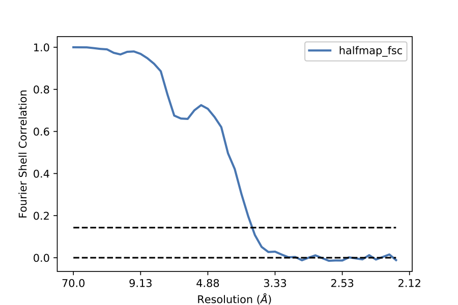

EMDA version 1.1.0
================================

.. toctree::
   :maxdepth: 2
   :caption: Contents:

EMDA is a Python library for Electron Microscopy map and model manipulations. It comes under MPL-2.0 license. It supports both Python3 and Python2.

Installation
-------------
Installing from source

This is the recommended method of installation of EMDA. 
To do this:

type 'pip install emda'

All necessary files will be installed under pythonx.x/site-packages/

e.g.: /Users/ranganaw/anaconda3/lib/python3.6/site-packages

Dependencies
-------------
EMDA has several dependencies in addition to general python modules (e.g. Numpy, Scipy).
They are pandas, gemmi, mrcfile and matplotlib.
All these dependencies will be automatically checked and installed, if necessary during
EMDA installation.

EMDA functionalities
---------------------
EMDA’s core functionalities include:

- Map input/output
- Resolution related functionalities
- Fourier Shell Correlation calculation
- Map-to-map fitting
- Three-dimensional correlation map calculation

EMDA I/O:
For this purpose, EMDA internally uses mrcfile and gemmi

Example 01: Reading .mrc/ccp4.map into a Numpy 3D array
###########################################################

Now let’s read in example map “emd_3651_half_map_1.map” using EMDA.
Let’s start by invoking python in terminal:

.. code-block:: Python

   $ python
   
Now you may import iotools from emda with

.. code-block:: Python

   from emda import iotools
   
To read the map in, we invoke the function read_map() from iotools. 

.. code-block:: Python

   unit_cell, arr, origin = iotools.read_map('emd_3651_half_map_1.map')
   
Unit_cell and origin are the corresponding entries in mrcfile header, while arr contains map values. You may check the shape of the numpy data array with 

.. code-block:: Python

   arr.shape 
   
Example 02: Fourier Shell Correlation (FSC) between half maps
##############################################################

Next, we’ll see how to calculate FSC between two half maps. In this case we assume that both halves have the same pixel sizes and sampling (no reason not be so :)).
For this we need to read the other half. We already have the first half read in (i.e. arr).
Let’s read in the other half by invoking:

.. code-block:: Python

   unit_cell, arr2, origin = iotools.read_map('emd_3651_half_map_2.map')

Now both arr and arr2 need to be Fourier translformed. This can be easily done using Numpy.fft functions.

.. code-block:: Python

   import numpy as np
   hf1 = np.fft.fftn(arr)
   
Also EMDA internally uses all frequencies arranged from negative to positive. Therefore, we need to rotate them accordingly. We will achieve this by

.. code-block:: Python

   hf1 = np.fft.fftshift(hf1)

Similarly, for the other half

.. code-block:: Python

   hf2 = np.fft.fftshift(np.fft.fftn(arr2))

In order to calculate FSC, we need to group structure factors according to their resolution. For this we can use ‘get_resolution_array() in emda.restools.

.. code-block:: Python

   from emda import restools
   nbin, res_arr, bin_idx = restools.get_resolution_array(unit_cell, hf1)

Res_arr is a numpy 1D array of resolution. nbin is the length of res_arr. bin_idx is a numpy 3D array of type ‘int’ where the res_arr has been read into a 3D grid by the corresponding bin number. Thus, bin number 0 corresponds to the lowest resolution shell.
Now FSC between half maps can be easily calculated using fsc mofule in emda.

.. code-block:: Python

   from emda import fsc
   bin_fsc,noisevar,signalvar,totalvar,fo,eo = fsc.halfmaps_fsc_variance(hf1,hf2,bin_idx,nbin)

bin_fsc = FSC between half maps in each bin (1D array)

noisevar = variance of noise in each bin (1D, float)

signalvar = variance of signal in each bin (1D, float)

totalvar = variance of signal and noise (1D, float)

fo = structure factors in full map (3D, complex)

e0 = normalized structure factors in full map (3D, complex)

In this exercise, let’s now plot bin_fsc vs res_arr using EMDA’s plotter. 

.. code-block:: Python

   from emda import plotter
   plotter.plot_nlines(res_arr,[bin_fsc])

Note that you need to supply bin_fsc inside a list. This is because plot_nlines() can be used to plot several lines simultaneously. Please see function signature section for more details.
You will find the plot ‘halfmap_fsc.eps’ in your working directory.

Here is the complete code for map reading and fsc calculation:

.. code-block:: Python
   :linenos:
   
   from emda import iotools, restools, fsc,plotter
   import numpy as np
   uc, ar, org = iotools.read_map('../other/emd_3651_half_map_1.map')
   uc, ar2, org = iotools.read_map('../other/emd_3651_half_map_2.map')
   hf1 = np.fft.fftshift(np.fft.fftn(ar))
   hf2 = np.fft.fftshift(np.fft.fftn(ar2))
   nbin, res_arr, bin_idx = restools.get_resolution_array(uc,hf1)
   bin_fsc,_,_,_,_,_ = fsc.halfmaps_fsc_variance(hf1,hf2,bin_idx,nbin)
   plotter.plot_nlines(res_arr,[bin_fsc])
   
FSC plot:

FSC between any two maps
#########################

In this example, we’ll learn how to calculate FSC between any two maps. We assume that the two maps have different voxel sizes or their samplings are different.

.. code-block:: Python

   from emda import iotools, restools, fsc, plotter
   uc,ar1,org = iotools.read_map('map1.mrc')
   uc2,ar2,org = iotools.read_map('map2.mrc')
   
In this case, our 

first map: map1.mrc sampling=(216, 216, 216) uc=[224.63998413, 224.63998413, 224.63998413]

Second map: map2.mrc sampling=(196, 196, 196) uc2=[203.83996582, 203.83996582, 203.83996582]

Now we want to calculate FSC between the two maps.
Before that, we need to resample the second map onto first map (or vice-versa). To achieve this EMDA has resmaple2staticmap() under iotools.
This function needs target_voxel_size, target_dims, uc2 and the data (arr2) to be resampled.
Let’s calculate them and resample arr2:

.. code-block:: Python

   target_vox_size = uc[0]/ar1.shape[0]
   target_dims = ar1.shape
   resampled_ar2 = iotools.resample2staticmap(target_vox_size,target_dims,uc2,ar2)

We will calculate the FSC as we did it in example 01.

.. code-block:: Python

   import numpy as np
   hf1 = np.fft.fftshift(np.fft.fftn(ar1))
   hf2 = np.fft.fftshift(np.fft.fftn(resampled_ar2))
   nbin, res_arr, bin_idx = restools.get_resolution_array(uc, hf1)
   bin_fsc, covar  = fsc.anytwomaps_fsc_covariance(hf1,hf2,bin_idx,nbin)

Only difference is that we use anytwomaps_fsc_covaraince() method from fsc module.
This is because, for this case, we are not aiming to calculate noise variance etc.
Covar is the covariance between the two maps and is the common signal.
You may plot this with

.. code-block:: Python

   plotter.plot_nlines(res_arr,[bin_fsc],'anytwomaps_fsc.eps',['map1-map2'])
   
Example 04: Apply a resolution limit to a map
##############################################

In this exercise, we are going to apply a resolution limit on the given map and output a low-resolution map. To do this, EMDA has cut_resolution() method in restools module.
Let’s read in the map with

.. code-block:: Python

    from emda import iotools, restools
    import numpy as np
    uc, ar, org = iotools.read_map('emd_3651_half_map_1.map')
    hf = np.fft.fftshift(np.fft.fftn(ar))
    nbin,res_arr,bin_idx = restools.get_resolution_array(uc,ar)

Let’s cut our map at 5 Angtrom.

.. code-block:: Python

   fout = restools.cut_resolution(hf,bin_idx,res_arr,5)
   
To write out the new map into .mrc format

.. code-block:: Python

   iotools.write_mrc(np.real(np.fft.ifftn(np.fft.ifftshift(fout))),'map5A.mrc',uc)

EMDA can also read and write MTZ files using gemmi.
Let’s output our new map into MTZ file with

.. code-block:: Python

   iotools.write_3d2mtz(uc,fout,'mtz5A.mtz')
   
   
Example 05: Fitting map to map
###############################

EMDA achieve map fitting by Maximum Likelihood optimization. Currently, EMDA needs two sets of maps with corresponding half data.

##TO DO: In general, map to map fitting should be able to carry out even only with just two maps. This capability will be available soon in EMDA.

Now, let’s define our list of maps as follows:

.. code-block:: Python

   maplist = ['str11.map',
              'str12.map',
              'hf1_trans0p01_rotated5deg.mrc',
              'hf2_trans0p01_rotated5deg.mrc']

The first pair corresponds to the half maps of the first map and the second pair with the second map. The first map is held static while the second map is rotated and translated on to the first map. Note that whatever the map to be static should be listed at the top of the maplist[].
EMDA can align any number of maps to the static map, so feel free to list more maps to be aligned in the maplist[] separated by commas.

To fit second map on to first map, just call fit module in EMDA as follows,

.. code-block:: Python

   from emda.mapfit import fit
   fit.main(maplist)

Fit.main method accepts several other arguments which are explained below.

ncycles=10; number of fitting cycles. Default is 10

t_init=[0.0, 0.0, 0.0]; initial translation along x, y, z in fractional coordinates (This will change soon). default is 0.0 in each direction. 

theta_init=0.0; initial rotation in degrees about z axis (TO DO: need to specify the axis). Default is 0.0

smax=6; maximum resolution of data for fitting.

You may pass any/all of these arguments into fit.main() specified by the relevant argument name to customize your fit.
Program outputs the rotation and translation at the end of each cycle. 
e.g.

#. 35867.113 0.0 0.0
#. 464960.8 5.103447085070437 0.008980524713833732
#. 735696.4 5.069678364958009 0.009704644599751545

Where the first column is the iteration cycle number and the second column is the accumulated rotation in degrees. Third column is the accumulated translation in fractional units.

At the end of the fit (in this case after 10 cycles) the program outputs final fit parameters i.e. Euler angles (degrees) and total translation. Then these fit parameters are applied on the second map and output rotated and translated second map into the working directory.

